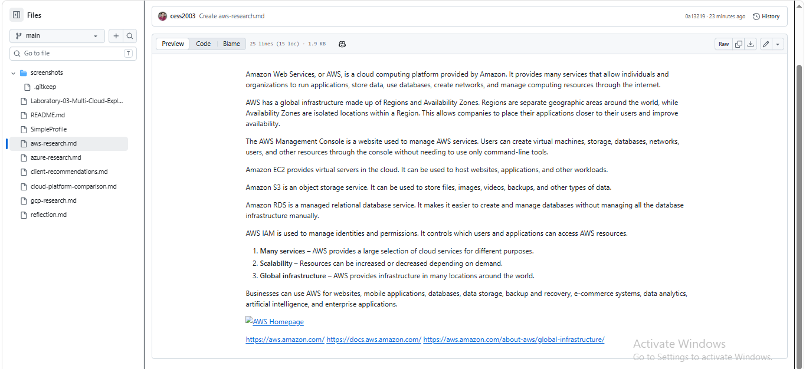

Amazon Web Services, or AWS, is a cloud computing platform provided by Amazon. It provides many services that allow individuals and organizations to run applications, store data, use databases, create networks, and manage computing resources through the internet.

AWS has a global infrastructure made up of Regions and Availability Zones. Regions are separate geographic areas around the world, while Availability Zones are isolated locations within a Region. This allows companies to place their applications closer to their users and improve availability.

The AWS Management Console is a website used to manage AWS services. Users can create virtual machines, storage, databases, networks, users, and other resources through the console without needing to use only command-line tools.

Amazon EC2 provides virtual servers in the cloud. It can be used to host websites, applications, and other workloads.

Amazon S3 is an object storage service. It can be used to store files, images, videos, backups, and other types of data.

Amazon RDS is a managed relational database service. It makes it easier to create and manage databases without managing all the database infrastructure manually.

AWS IAM is used to manage identities and permissions. It controls which users and applications can access AWS resources.

1. **Many services** – AWS provides a large selection of cloud services for different purposes.
2. **Scalability** – Resources can be increased or decreased depending on demand.
3. **Global infrastructure** – AWS provides infrastructure in many locations around the world.

Businesses can use AWS for websites, mobile applications, databases, data storage, backup and recovery, e-commerce systems, data analytics, artificial intelligence, and enterprise applications.

https://aws.amazon.com/
https://docs.aws.amazon.com/
https://aws.amazon.com/about-aws/global-infrastructure/
