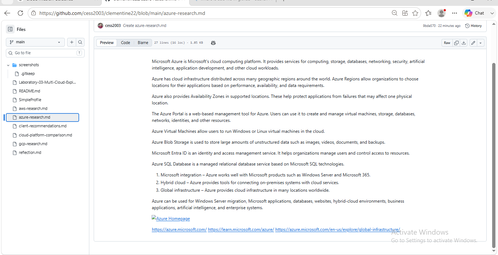

Microsoft Azure is Microsoft's cloud computing platform. It provides services for computing, storage, databases, networking, security, artificial intelligence, application development, and other cloud workloads.

Azure has cloud infrastructure distributed across many geographic regions around the world. Azure Regions allow organizations to choose locations for their applications based on performance, availability, and data requirements.

Azure also provides Availability Zones in supported locations. These help protect applications from failures that may affect one physical location.

The Azure Portal is a web-based management tool for Azure. Users can use it to create and manage virtual machines, storage, databases, networks, identities, and other resources.

Azure Virtual Machines allow users to run Windows or Linux virtual machines in the cloud.

Azure Blob Storage is used to store large amounts of unstructured data such as images, videos, documents, and backups.

Microsoft Entra ID is an identity and access management service. It helps organizations manage users and control access to resources.

Azure SQL Database is a managed relational database service based on Microsoft SQL technologies.

1. Microsoft integration – Azure works well with Microsoft products such as Windows Server and Microsoft 365.
2. Hybrid cloud – Azure provides tools for connecting on-premises systems with cloud services.
3. Global infrastructure – Azure provides cloud infrastructure in many locations worldwide.

Azure can be used for Windows Server migration, Microsoft applications, databases, websites, hybrid-cloud environments, business applications, artificial intelligence, and enterprise systems.

https://azure.microsoft.com/
https://learn.microsoft.com/azure/
https://azure.microsoft.com/en-us/explore/global-infrastructure/
